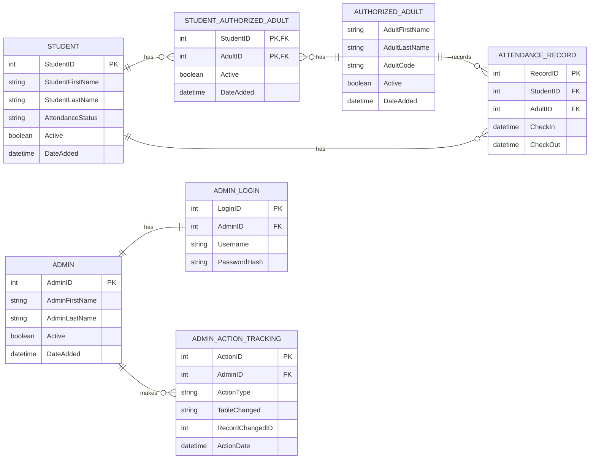

```mermaid
    erDiagram
    direction LR
        STUDENT ||--o{ STUDENT_AUTHORIZED_ADULT : has
        STUDENT_AUTHORIZED_ADULT }o--|| AUTHORIZED_ADULT : has

        STUDENT ||--o{ ATTENDANCE_RECORD : has
        AUTHORIZED_ADULT ||--o{ ATTENDANCE_RECORD : records

        ADMIN ||--|| ADMIN_LOGIN : has
        ADMIN ||--o{ ADMIN_ACTION_TRACKING : makes

        STUDENT {
            int StudentID PK
            string StudentFirstName
            string StudentLastName
            string AttendanceStatus
            boolean Active
            datetime DateAdded
        }

        AUTHORIZED_ADULT {
            string AdultFirstName
            string AdultLastName
            string AdultCode
            boolean Active
            datetime DateAdded
        }

        ATTENDANCE_RECORD {
            int RecordID PK
            int StudentID FK
            int AdultID FK
            datetime CheckIn
            datetime CheckOut
        }

        STUDENT_AUTHORIZED_ADULT {
            int StudentID PK, FK
            int AdultID PK, FK
            boolean Active
            datetime DateAdded
        }

        ADMIN {
            int AdminID PK
            string AdminFirstName
            string AdminLastName
            boolean Active
            datetime DateAdded
        }

        ADMIN_LOGIN {
            int LoginID PK
            int AdminID FK
            string Username
            string PasswordHash
        }

        ADMIN_ACTION_TRACKING {
            int ActionID PK
            int AdminID FK
            string ActionType
            string TableChanged
            int RecordChangedID
            datetime ActionDate
        }
```